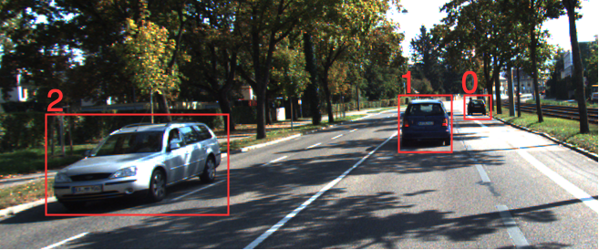
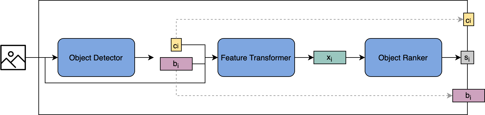
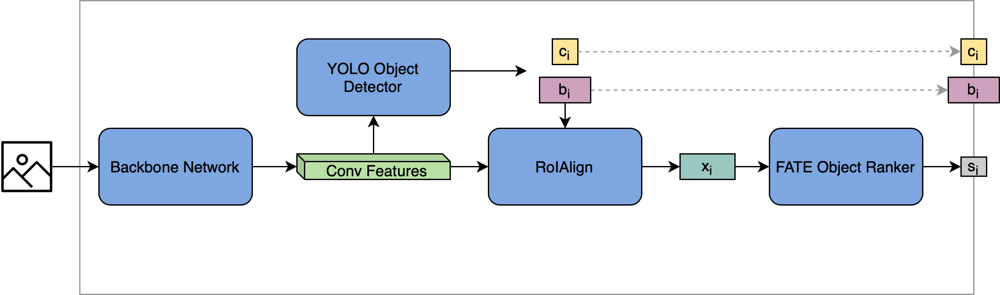

# Image Object Ranking (iorank)

This repository contains a Python framework for image object ranking. In image object ranking, the goal is to set image objects in relation to each other by predicting a ranking of these objects. 

In this repository there are two model architectures for image object ranking implemented, which first utilize object detection to detect the image objects and then apply an object ranking algorithm for determining the order of the objects.

While the implementation in this repository focuses on depth ordering, it can also be adapted to other ranking criterions such as object size.

Example for a depth ordering of three objects:

<p align="center">
  
</p>

## Model Architectures

There are two model architectures implemented. 

### Component Architecture
<p align="center">
  
</p>

The component architecture consists of three components:
* Object Detector: Detects the image objects
* Feature Transformer: Produces a fixed-sized feature vector for each detected object
* Object Ranker: Ranks the detected objects based on their feature represenation

### End-To-End Architecture
<p align="center">
  
</p>

The End-To-End Architecture is an end-to-end trainable architecture, which is jointly optimized for both object detection and object ranking. For object detection, the YOLO object detector has been adapted. For object ranking, a FATE object ranker is used.

 
## Repository Structure
* .singularity: Contains files for Singularity support.
* datasets: Contains converters that prepare datasets for using them in this framework. Currently, only the KITTI dataset is supported.
* examples: Contains code examples for training the implemented models.
* experiments: Contains data describing the experiments that have been made with the implemented models.
* images: Contains images for this readme file.
* iorank: Contains the actual implementation of the framework
* mde: Contains an implementation of the handcrafted features described in [this paper](https://ieeexplore.ieee.org/document/8019434)
* models: Contains a pretrained model for the demo
* torchcsrank: Contains a PyTorch implementation of the FATE and FETA models from the [cs-ranking library](https://github.com/kiudee/cs-ranking).

 
## How to use

### Requirements
- Anaconda
- CUDA is highly recommended as training on CPU takes very long

### Install dependencies
First, setup a new Anaconda environment:
```bash
conda create -n iorank --yes -q pip python=3.6
conda activate iorank
```

Install PyTorch:
```bash
conda install --yes pytorch torchvision -c pytorch
```

Install further dependencies:
```bash
conda install --yes scipy h5py imageio pygmo qt -c conda-forge
pip install scikit-image opencv-python-headless
```

Install the csrank library:
```bash
pip install git+https://github.com/kiudee/cs-ranking.git
```

### Use Singularity
Instead of setting up an Anaconda environment by hand, a Singularity image can used.

To this end, the Singularity image has to be built using the definition .singularity/iorank.def first:
```bash
sudo singularity build iorank.sif .singularity/iorank.def
```

Then, the image can be used as follows:
```bash
singularity run --nv iorank.sif python <file>
```

## Prepare the dataset

Currently, the framework works only with the [KITTI dataset](http://www.cvlibs.net/datasets/kitti/index.php). In order to use this dataset, the following steps have to be done:
1. Download the raw KITTI dataset from http://www.cvlibs.net/datasets/kitti/raw_data.php to a directory *images_dir*. It is recommended to use the proposed download script. 
2. Download the KITTI depth map dataset from http://www.cvlibs.net/datasets/kitti/eval_depth.php?benchmark=depth_completion and extract the downloaded zip file into a directory *depthmaps_dir*.
3. Download the training labels from the object detection set from http://www.cvlibs.net/datasets/kitti/eval_object.php?obj_benchmark=2d and extract the downloaded zip file into a directory *boxes_dir*.
4. Prepare the dataset using the KITTI Dataset converter:
```bash
python datasets/kitti/kitti_converter.py -i <images_dir> -b <boxes_dir> -d <depthmaps_dir> -o <output_dir>
```
The dataset is now available in *output_dir*. There is a fixed train/test split, thus the training data are available in *output_dir*/KITTI/train and the test data in *output_dir*/KITTI/test.

## Demo

The framework can be tried out with a small demo that uses a pretrained model:
```bash
python demo.py -i <some_image>
```
It produces and visualizes a prediction for the provided input image.

## Train the models

In order to simply train the implemented models, the scripts in the *example* folder can be used:

### Component Architecture
Example:
```bash
python examples/train_component_model.py -d /home/someuser/mydatasets # Path to the dataset folder
                                --object_detector faster-rcnn # Use Faster R-CNN object detector
                                --feature_transformer resnet # Use ResNet features for feature transformation
                                --object_ranker torch-fate-ranker # Use PyTorch version of the FATE object ranker
                                
```

### End-To-End Architecture
Example:
```bash
python examples/train_e2e_model.py -d /home/someuser/mydatasets # Path to the dataset folder
                          --backbone resnet # Use a ResNet backbone network
                          --cells 7 # Use a 7x7 grid for YOLO object detection
                                
```
